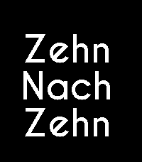
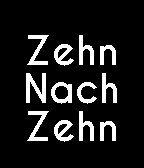
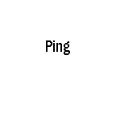

# Lazy Watch German

A Pebble watchface that displays the time as spoken German phrases, using a large custom font with smooth slide animations on every minute change.

Originally forked from [MegustaCode/lazy_watch](https://github.com/MegustaCode/lazy_watch), which is a German translation of Pebble's official `fuzzy_time` SDK example.

## Screenshots

| Pebble Time 2 (emery) | Pebble Time (basalt) | Pebble Classic (aplite) |
|:---:|:---:|:---:|
|  |  |  |

## Features

- **German fuzzy time**: time is spoken in natural German rather than shown as digits:

  | Time | Display |
  |------|---------|
  | 3:00 | `drei` |
  | 12:00 | `zwölf` |
  | 0:00 | `null` |
  | 3:05 / 3:10 | `fünf nach drei` / `zehn nach drei` |
  | 3:15 | `viertel nach drei` |
  | 3:30 | `halb vier` |
  | 3:45 | `viertel vor vier` |
  | 3:50 / 3:55 | `zehn vor vier` / `fünf vor vier` |
  | 3:22 | `drei uhr zwei und zwanzig` |

- **Adaptive font sizing**: automatically picks from three font sizes (small, medium, large) so the text always fills the screen as large as possible without overflow.
- **Slide animation**: on every minute tick, the outgoing text slides left off-screen while the new text slides in from the right, playing exactly once per change.
- **Configurable colors**: background and text color are independently configurable via the Pebble app. Settings persist across reboots.
- **Readability styling**: the connector words "vor", "nach", and "Uhr" can be rendered bold (default), normal, or italic, to make them easier to tell apart from the numbers.
- **Night mode**: an independent background/text color scheme that switches on automatically during a configurable time window (e.g. 22:00–06:00), for a dimmer display at night.
- **Timeline Quick View**: the layout adapts when Pebble's timeline peek overlays the watchface.

## Supported platforms

- **Aplite**: Pebble / Pebble Steel
- **Basalt**: Pebble Time / Pebble Time Steel
- **Diorite**: Pebble 2
- **Emery**: Pebble Time 2

## Building

```sh
pebble build
```

Requires the [Pebble SDK](https://developer.rebble.io/developer.pebble.com/sdk/index.html). The compiled `.pbw` is written to `build/`.

## Taking screenshots

```sh
make screenshots           # capture at current time
make screenshots TIME=10:10  # capture at a specific time
```

Builds the project, boots a QEMU emulator for each supported platform, installs the watchface, and saves `screenshots/{platform}_{HH-MM}.png`. Requires `jq`.

## License

MIT — see [LICENSE](LICENSE). The German word-conversion logic derives from Pebble Technology's `fuzzy_time` SDK example, also MIT licensed.
